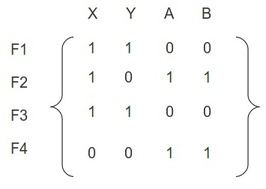
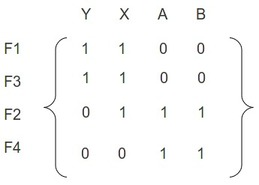
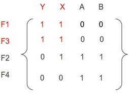
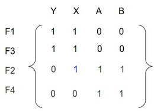
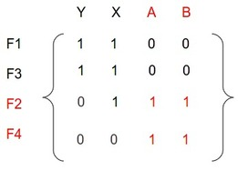
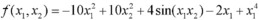
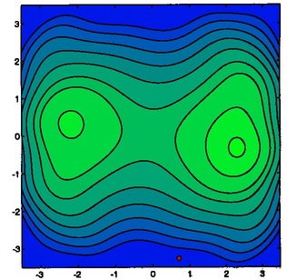
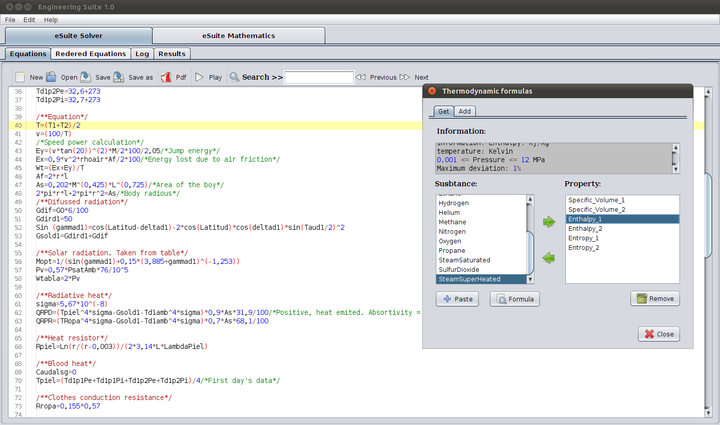
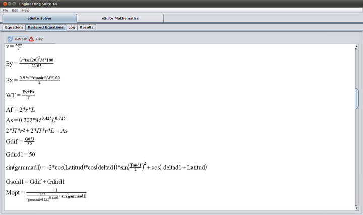
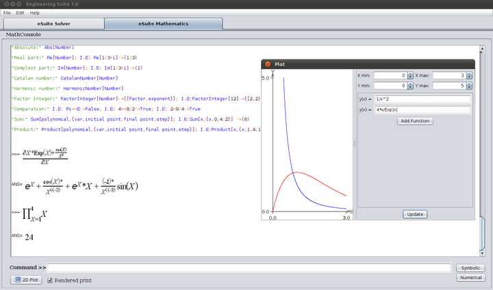

# Engineering Suite - Image Assets

This directory contains image files used within the Engineering Suite application or its documentation. They primarily serve to illustrate core concepts, algorithms, and GUI elements.

## Image Categories and Descriptions

The images can be broadly categorized as follows:

### 1. Tarjan Algorithm / Equation Ordering Visualization

These images demonstrate how the Tarjan algorithm identifies and separates coupled systems of equations from a larger set, allowing them to be solved sequentially or independently. They typically show the evolution of the incidence matrix (representing variable dependencies within equations).

*   **`1Sinordenar.jpg`**: Shows the initial, unsorted incidence matrix representing the relationships between variables (columns) and functions (rows).
    
*   **`2Ordenado.jpg`**: Shows the same matrix after applying Tarjan's algorithm, reordering rows and columns to group strongly connected components (coupled subsystems) together, often revealing a block lower triangular structure.
    
*   **`3Sistema1.jpg`**: Highlights the first independent subsystem identified within the ordered matrix.
    
*   **`4VariableSuelta.jpg`**: Illustrates how a variable becomes known after solving a subsystem, simplifying subsequent subsystems.
    
*   **`5Sistema2.jpg`**: Highlights the next subsystem to be solved, potentially simplified by variables solved in previous steps.
    

**Potential Use:** These images are excellent for creating a tutorial or help section explaining how eSuite optimizes the solving process by breaking down large problems. An advanced example could involve creating a complex `.ris` file and showing how its corresponding matrix gets decomposed using these visual steps.

### 2. Trust Region Method / Optimization Algorithm Visualization

These images likely illustrate the iterative steps of a trust-region optimization algorithm (like Dogleg or More-Hebdon, which are available in eSuite) applied to a sample 2D function.

*   **`function.jpg`**: Possibly shows the contour plot of the objective function being minimized (e.g., sum of squares of residuals).
    
*   **`Image1.jpg` to `Image7.jpg`**: These likely represent sequential steps in the optimization process:
    *   Showing the current iterate (e.g., red dot).
    *   Showing the trust region (black circle).
    *   Showing the calculated step (e.g., leading to a red cross).
    *   Showing the update of the iterate and the trust region radius for the next step.
    

**Potential Use:** These can be used to explain the concept of trust-region methods in the help files or documentation. An advanced example could involve solving a 2-variable non-linear system in eSuite and comparing the iteration log to these visual steps.

### 3. GUI Screenshots

These images show various parts of the Engineering Suite application interface.

*   **`Main.png`**: Screenshot of the main application window, likely showing the "eSuite Solver" tab.
    
*   **`Equations.png`**: Focuses on the "Rendered Equations" tab, showcasing the MathML rendering capability.
    
*   **`Mathematics.png`**: Shows the "eSuite Mathematics" tab, including the symbolic console and the 2D Plotting window.
    

**Potential Use:** These are useful for general documentation, user manuals, tutorials on how to use different parts of the application, or for illustrating specific features like equation rendering or plotting. An example could walk through using the plotting feature accessed from the "eSuite Mathematics" tab.

## File List

*   `1Sinordenar.jpg`
*   `2Ordenado.jpg`
*   `3Sistema1.jpg`
*   `4VariableSuelta.jpg`
*   `5Sistema2.jpg`
*   `Equations.png`
*   `function.jpg`
*   `Image1.jpg`
*   `Image2.jpg`
*   `Image3.jpg`
*   `Image4.jpg`
*   `Image5.jpg`
*   `Image6.jpg`
*   `Image7.jpg`
*   `Main.png`
*   `Mathematics.png`

---

Feel free to use these images to enhance documentation or create new, illustrative examples for the `/examples` directory.